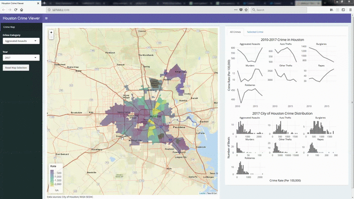
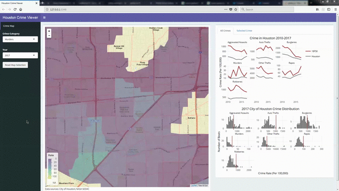

Houston Crime Explorer
----------------------

[The app](https://seasmith.shinyapp.io/HoustonCrimeViewer) allows you to explore the City of Houston crime data set through the use of an interactive choropleth map, line charts, histograms, and an hour-by-hour heatmap. All instances of crime rate refer to the rate per 100,000 persons.

### Tour

The choropleth map gives you a tooltip with some helpful information.

Selecting police beats on the map changes the output of the plots. 

Deselecting the police beat resets the plots.

The map changes when the crime type is changed.

You can also change the year.

### Build It

The app is available [online](https://seasmith.shinyapp.io/HoustonCrimeViewer). However, you can run this app yourself.

To run the app, you will need to:

1.  [Install R](https://cran.r-project.org/)
2.  [Install RStudio](https://www.rstudio.com/products/rstudio/download/#download)
3.  [Install Git](https://git-scm.com/downloads)
4.  Clone this project: `git clone https://github.com/seasmith/HoustonCrimeViewer HoustonCrimeViewer`
5.  Install `devtools` and `packrat`: `install.packages(c("devtools", "packrat"))`
6.  Install requisite packages: `packrat::install_deps()` (the `DESCRIPTION` file exists for this purpose, this repo is **not** a package)
7.  Execute `shiny::runApp()`

Please create an issue if something does not go as planned.

Future Versions
---------------

### Definitive Additions

Some things which **will** eventually be added:

-   A 'data brief' section to document:
    -   Data distribution
    -   Missing/anomalous data
-   `plotly` maps.
    -   Lasso-selection
    -   Multi-selection
    -   Satellite imagery
-   Start- and end-year range selection.
    -   Currently, the server gets hung up when the slider is used. May have to resort to using another dropdown menu.
-   School district polygons. This may make the map look a little messy, so this may be placed in its own separate map or as a static report per school district.
-   Toggle certain beats that skew the crime rates. Right now, this is pre-set (the grayed-out polygons).
-   Select which variable to map. Currently `rate` is used, but others may include:
    -   `n_offenses` (number of offenses)
    -   `n_offenses / pop_den` (number of offenses divided by population density)
-   Attach names to the police beats:

| Police Beat | Name                               |
|-------------|------------------------------------|
| 1A20        | West Montrose                      |
| 1A30        | East Montrose                      |
| 1A40        | River Oaks                         |
| 1A50        | Afton Oaks                         |
| 2A20        | The Heights (East)                 |
| 2A30        | The Heights (Central)              |
| 2A40        | First Ward                         |
| 2A50        | Rice Military                      |
| 2A60        | The Heights (West)                 |
| 3B30        | Oak Forest                         |
| 3B40        | Independence Heights               |
| 4F30        | Addicks Reservoir                  |
| 6B60        | Greenspoint                        |
| 10H40       | Midtown                            |
| 10H50       | Third Ward (University of Houston) |
| 10H70       | Museum District                    |
| 12D50       | Clear Lake (North)                 |
| 12D60       | Clear Lake (Central)               |
| 10H80       | Rice Village                       |
| 14D20       | Sunnyside                          |
| 15E40       | The Astrodome                      |
| 17E10       | Gulfton                            |
| 18F10       | Tanglewood (Houston)               |
| 18F20       | The Galleria                       |
| 18F30       | Fountainview                       |
| 18F40       | Piney Point                        |
| 19G10       | Alief (East)                       |
| 19G20       | Alief (Central)                    |
| 19G30       | Alief (West)                       |
| 19G40       | Alief (South)                      |
| 20G30       | West Chase                         |
| 20G50       | City Centre                        |
| 20G60       | Memorial                           |
| 20G80       | Barker Reservoir                   |

### Probable Additions

Some things which **may** be added:

-   Address input. Ideally, a user should be able to enter their address to highlight the police beat in which the live.
-   Geocoding all crimes. There are hundreds of thousands of unique block ranges (block ranges are the addressing method used by the Houston Police Department). Focus may be prioritized on recent years, starting with 2017.
-   Census data. This may include income, age, race, and other data available through the census.
-   Turn this project into a package. Vignettes would act as reports and summaries.
-   Vega/Vega-lite graphics.

Data sources
------------

| Type            | Source                                                                                     |
|-----------------|--------------------------------------------------------------------------------------------|
| Crime data      | [City of Houston](http://www.houstontx.gov/police/cs/crime-stats-archives.htm)             |
| Police beats    | [City of Houston](https://cohgis-mycity.opendata.arcgis.com/datasets/houston-police-beats) |
| Population data | [NASA SEDAC](http://sedac.ciesin.columbia.edu/data/collection/gpw-v4)                      |
